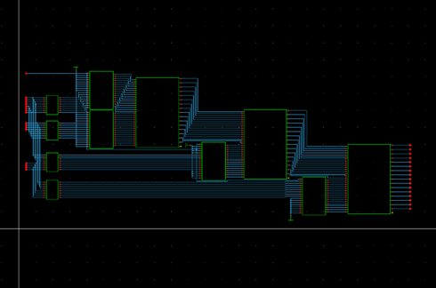
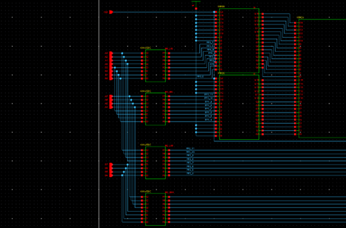
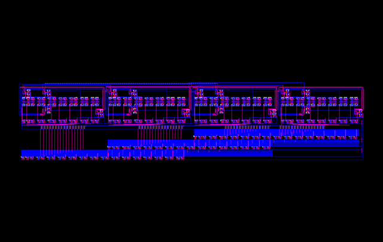
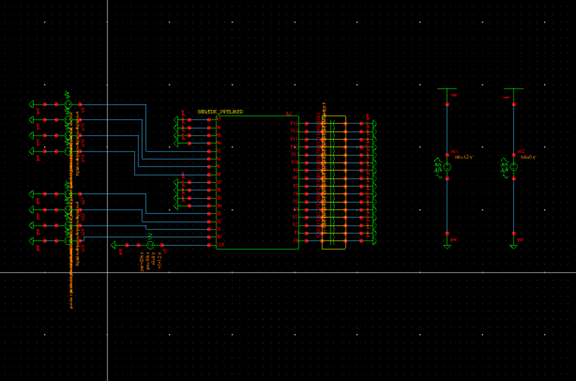
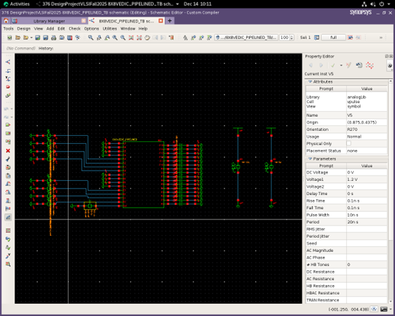
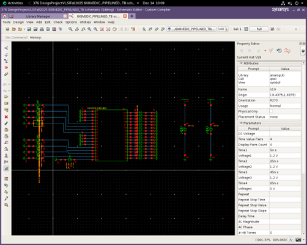
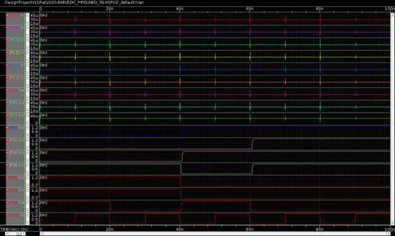
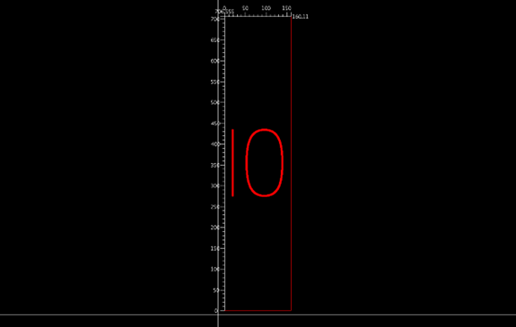

# 8-Bit Pipelined Vedic Multiplier (90nm CMOS)

Design and full-custom implementation of an 8-bit pipelined Vedic multiplier using 90nm CMOS technology.  
This project demonstrates hierarchical digital design, pipeline-based performance optimization, and physical verification through layout, DRC, and LVS.

---

## System Overview


This system implements an 8×8 multiplier using the Vedic Urdhva Tiryakbhyam algorithm, combined with pipelining to improve throughput and isolate critical path delays.

---

## Architecture



The multiplier is built hierarchically:

- 8×8 multiplier composed of **four 4×4 Vedic multipliers**
- Each 4×4 block built from **2×2 Vedic multipliers**
- Intermediate results combined using **16-bit ripple carry adders (RCA)**
- **Pipeline registers (16REG)** inserted between major computation stages

### Key Architectural Properties

- Parallel partial product generation (Vedic multiplication)
- Modular and reusable hierarchy
- Clear separation between combinational and sequential stages

---

## Why Vedic Multiplication?

Conventional multipliers (array, Booth) suffer from:

- deep combinational paths  
- long carry propagation delays  

The Vedic (Urdhva Tiryakbhyam) algorithm:

- generates partial products **in parallel**
- reduces logical depth
- enables efficient hierarchical decomposition

This makes it well-suited for:

- high-speed arithmetic units  
- scalable VLSI architectures  

---

## Pipelining Strategy (Core Design Decision)



Pipelining was introduced to **reduce the effective critical path**.

### Placement

Pipeline registers are inserted:

> between 4×4 multiplier outputs and 16-bit RCA stages

---

### Why this matters

Without pipelining:

- carry propagation spans multiple stages  
- clock frequency is severely limited  

With pipelining:

- each stage is isolated  
- longest delay = **single RCA stage**  
- new inputs accepted every clock cycle  

---

### Result

By inserting registers between the 4×4 multiplier outputs and the 16-bit RCA stage:

- the carry propagation path is confined to a **single RCA stage**
- the global critical path is reduced to one pipeline stage  
- the system achieves **1-cycle latency** from input to output  
- after pipeline fill, the design sustains **1 result per clock cycle**  

This demonstrates that performance improvement is achieved through **architectural pipelining**, not by optimizing individual arithmetic blocks.

---

## Why Ripple Carry Adders (RCA)?

Instead of faster adders (CLA, CSA), RCA was chosen deliberately:

### Trade-off

| Option | Pros | Cons |
|------|------|------|
| RCA | simple, compact, predictable | slower carry propagation |
| CLA/CSA | faster | complex layout, higher area |

---

### Justification

- Pipelining **limits carry propagation to one stage**
- removes need for complex adder logic
- simplifies layout and routing

This is a **system-level optimization**, where pipelining eliminates the need for faster but more complex adder architectures

---

## Circuit-Level Design

- Technology: **90nm CMOS**
- Supply Voltage: **1.2V**
- Design Style: **Full-custom (transistor-level)**

### Key Blocks

- Inverter, NAND, XOR → primitive gates
- Half Adder / Full Adder → arithmetic units
- **TGATE D Flip-Flop** → pipeline registers

---

### Why Transmission-Gate DFF?

- full rail-to-rail swing  
- low static power  
- robust at low voltage  
- avoids threshold loss of pass-transistor logic  

---

## Layout Implementation



Hierarchical layout methodology:

1. Primitive cells (INV, NAND, XOR, TGATE)
2. Mid-level blocks (HA, FA, DFF)
3. Top-level integration

---

### Key Design Challenges

- routing congestion at top level  
- pin accessibility in hierarchical blocks  
- clock distribution  

---

### Solutions

- multi-metal routing (M1, M2, M3)
- improved pin placement
- modular layout reuse

---

## Physical Verification

### DRC (Design Rule Check)

- **0 violations**
- ensures manufacturability

### LVS (Layout vs Schematic)

- **netlist match confirmed**
- guarantees layout correctness

---

## Simulation & Verification

### Testbench Design



The system was verified using a structured testbench consisting of:

- **VPULSE clock source (50 MHz)** for synchronous operation  
- **VPWL input sources** for controlled stimulus of A[7:0] and B[7:0]  
- capacitive loading on outputs to model realistic conditions  



The clock signal defines discrete evaluation intervals, ensuring that all pipeline stages operate synchronously.

---

### Input Stimulus



Inputs are applied using time-controlled VPWL signals aligned with clock edges.  
This ensures deterministic evaluation and avoids race conditions across pipeline stages.

---

### Pipeline Operation & Functional Verification



The simulation waveform demonstrates both **functional correctness** and **pipeline behavior**:

- Input values change at clock edges  
- Output does **not update immediately**, indicating pipeline staging  
- The result appears **one clock cycle after input application**, directly reflecting the register placement between multiplier and RCA stages
- After initial latency, the system produces **one output per clock cycle**  

---

### Key Observations

- **Correct multiplication results** for all tested input combinations  
- **1-cycle pipeline latency**, consistent with register placement between computation stages  
- **Stable outputs with no glitches**, indicating proper synchronization  
- Sustained throughput at **50 MHz operation**  

---

### What This Validates

- correctness of Vedic multiplication implementation  
- proper synchronization of sequential and combinational blocks  
- effectiveness of pipelining in isolating the critical path  
- reliable operation under clock-driven conditions  

---

## Performance Evaluation



### Results

- Operating Frequency: **50 MHz**
- Area: **113,125.72 µm²**
- Avg Propagation Delay: **453.21 ps**
- Worst Case Delay: **654 ps**

---

### Critical Path

- confined to **16-bit RCA stage**
- isolated via pipelining

---

## Design Trade-offs

| Goal | Decision | Impact |
|-----|--------|--------|
| Speed | Pipelining | ↑ throughput |
| Simplicity | RCA | ↓ complexity |
| Robustness | TGATE DFF | reliable timing |
| Area | hierarchical layout | manageable scaling |

---

## Key Takeaways

- Pipelining is more effective than optimizing individual blocks  
- architecture decisions dominate performance  
- layout constraints strongly influence design choices  
- verification must be integrated at every stage  

---

## Project Structure

```text
.
├── schematics/
├── layouts/
├── verification/
├── docs/
└── README.md
```

---

## Full Report

For detailed design methodology, circuit schematics, and analysis:

[View Full Report](docs/report/EE584_Pipelined_Vedic_Multiplier_Report.pdf)

---

## Summary

This project demonstrates a complete VLSI design flow:

architecture → circuit → layout → verification

and highlights how:

pipelining + hierarchical design
outperform brute-force combinational optimization

---

## Author

Oluwaferanmi Arowoshola
M.S. Electrical & Computer Engineering
Embedded Systems · Real-Time Systems · IoT
